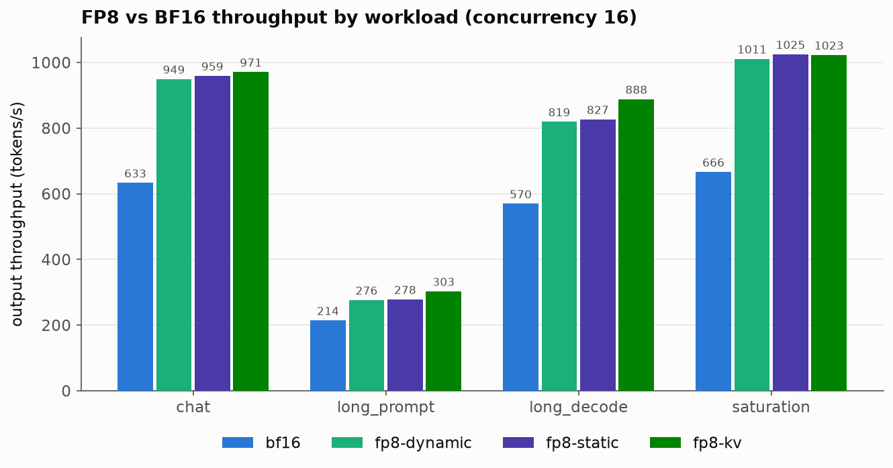
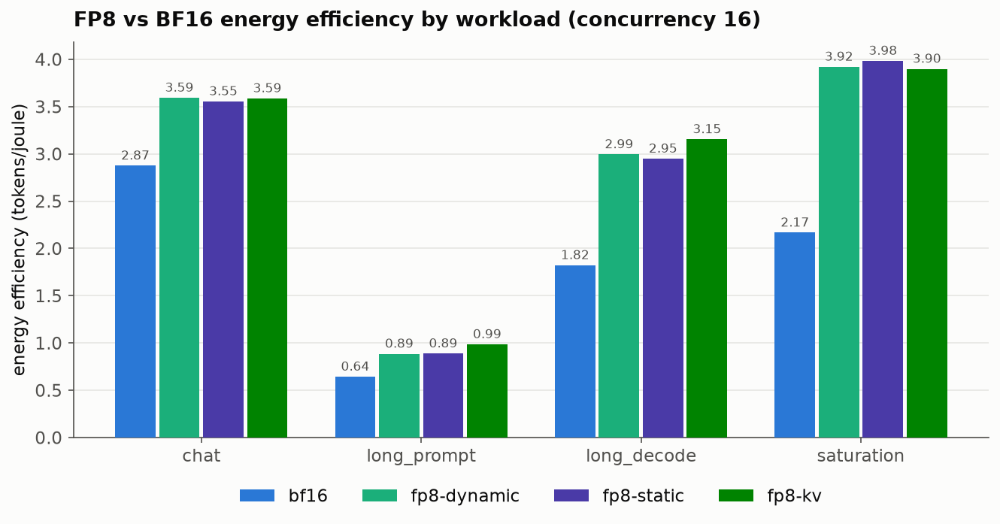
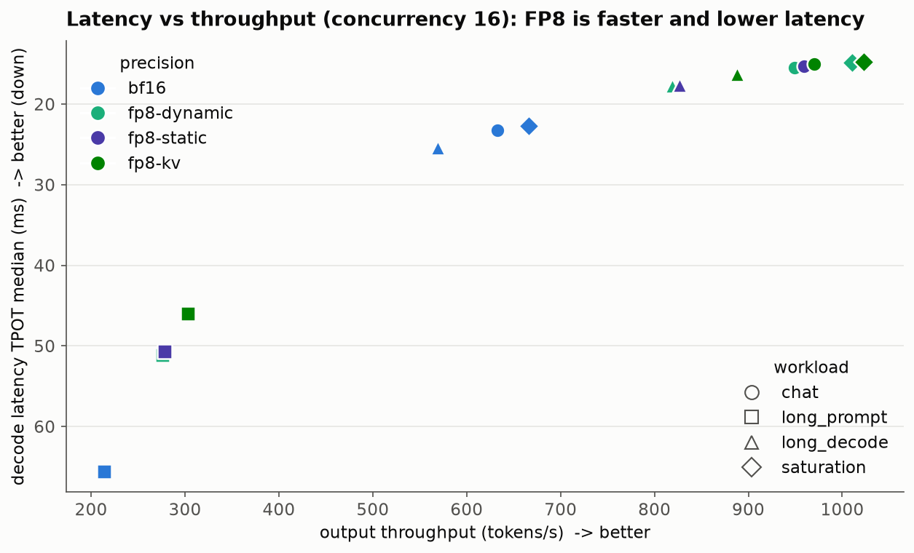
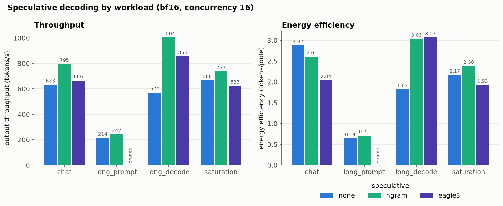
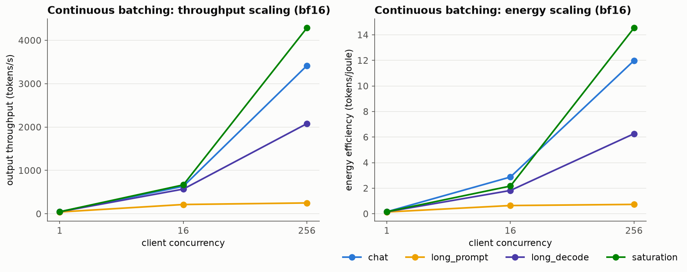
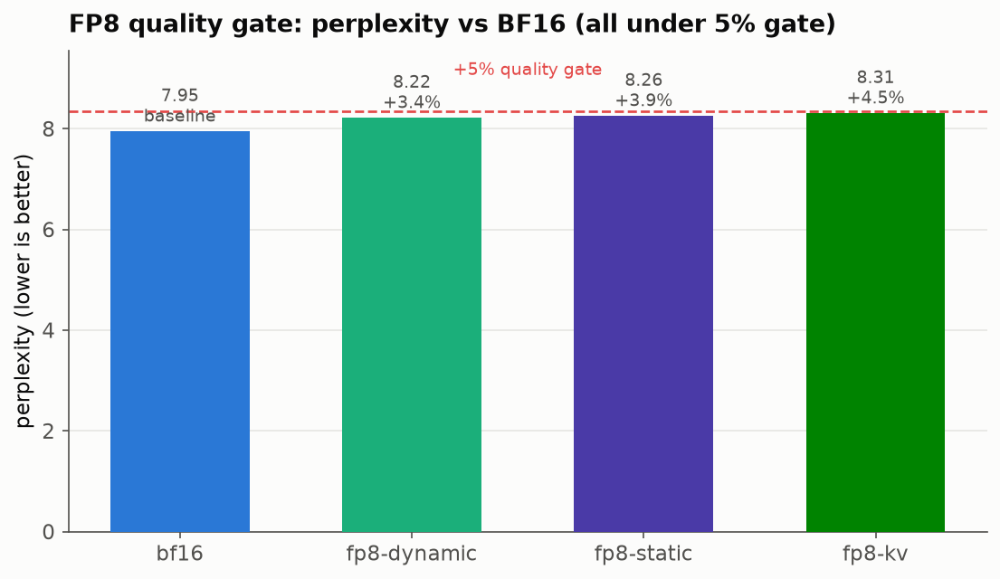
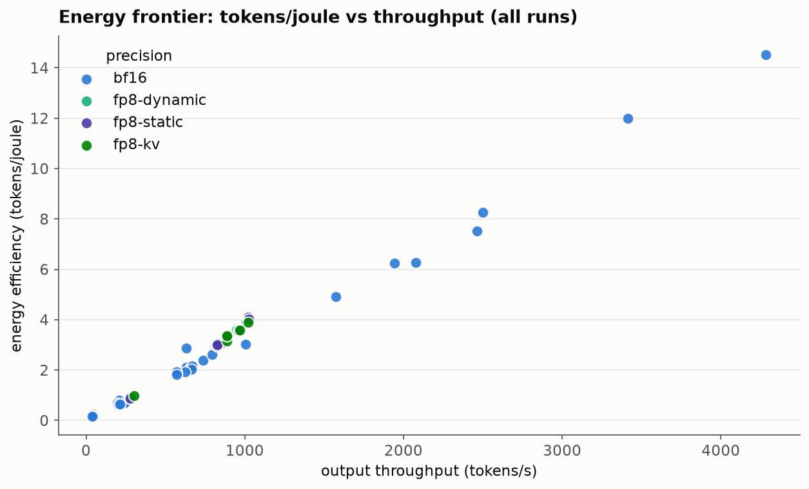

# vllm-optimization-bench

Note on names: tokens like fp8-static, fp8-kv, fp8-dynamic, long_prompt, long_decode,
max_num_seqs, chunked_prefill, compressed-tensors, --max-model-len, --torch-backend, and
the cu129 wheel name are literal configuration values, flags, or file names. They are kept
exactly as they appear in the project so the RE stays accurate.

## Problem statement

Build a reproducible benchmark harness that measures latency, throughput, and energy for
common vLLM inference optimizations on a single NVIDIA L40S GPU, and run it as a matrix of
experiments. The optimizations covered are FP8 quantization (weight only and with FP8 KV
cache), speculative decoding (ngram and EAGLE-3), chunked prefill on or off, continuous
batching (server max_num_seqs), and client concurrency. The model under test is
Llama 3.1 8B Instruct. Each run launches a vLLM server, drives it with the vLLM benchmark
client, records per GPU telemetry from DCGM, and writes one result row. The experiment
design is one factor at a time axes around a baseline, plus a set of interaction cells,
plus repeated runs for the energy headline cells.

## Why I chose this

What is grounded in the sources is the shape of the work: the harness is
built specifically to quantify the speed and energy tradeoffs of well known vLLM serving
optimizations on one accessible datacenter GPU, using tokens per joule as a first class
metric alongside latency and throughput. The presence of dedicated energy headline cells
with repeated runs shows energy behavior was a deliberate focus.

## Why it matters

The harness
produces, for each optimization and workload, three things that drive the cost and user
experience of serving a large language model: time to first token (TTFT), per token decode
latency (TPOT), output throughput in tokens per second, and energy efficiency in tokens
per joule. By sweeping optimizations one at a time against a fixed baseline and adding
interaction cells, the results show where each optimization helps, where it does not, and
where two optimizations interact. A validity gate and repeated energy runs are included so
that the energy numbers are trustworthy on a shared machine rather than taken at face
value.

## Approach and methodology (detailed steps)

Environment. The work ran on the CMU LTI Babel shared cluster on a node with 8 NVIDIA
L40S GPUs (about 48 GB each, FP8 capable), driver 575.51.03, scheduled through SLURM with
the general partition. DCGM is installed cluster wide for telemetry. The final software
stack is vLLM 0.24.0 installed from its cu129 wheel variant, torch 2.11.0+cu129, CUDA 12.9,
Python 3.11.15. All heavy state (the virtual environment, the uv caches, the Hugging Face
cache, and the vLLM compile cache) lives on /data/user_data because home has very little
free space.

Experiment matrix. A matrix engine expands the configuration into cells. There are three
sources: baseline (4 cells, one per workload), one factor at a time axes (ofat, 39 cells),
and interaction cells (40 cells). The full matrix is 83 cells after one combination is
pruned. Workloads are chat, long_prompt, long_decode, and saturation, defined by input and
output token lengths and prompt counts. EAGLE-3 forces chunked_prefill off, which the
engine applies as a normalization rather than a prune. Energy headline cells are run 5
times each so the report can show a median and an inter quartile range.

Per run pipeline. For each cell the harness launches a vLLM server with the right flags,
waits for the health endpoint, samples DCGM (power, SM active, tensor active, DRAM active,
frame buffer used, clocks, temperature, throttle reasons) pinned to the GPU UUID, runs the
vLLM benchmark client to capture TTFT, TPOT, and throughput, computes tokens per joule,
applies a validity gate, writes one JSON row per cell, and tears the server down. The
result store writes one atomic JSON file per cell so parallel SLURM jobs do not race, and
runs.parquet is a derived export. Runs are resumable: a cell that already has a row is
skipped.

Number of prompts. The benchmark prompt count scales with effective parallelism, computed
as min(concurrency, max_num_seqs) times 16 with a floor of 16. Throughput, latency, and
energy are rate metrics, so a smaller count at low parallelism does not bias them and it
keeps serialized cells from running for hours.

Validity gate. A run is marked contaminated only on a directly detectable hardware
condition, namely thermal or hardware clock throttle (with an optional neighbor power cap).
SM active is recorded as an informational energy_gpu_bound flag but is not used to decide
validity, because LLM decode is memory bandwidth bound and legitimately shows moderate SM
active. Residual shared node noise is surfaced through the repeated energy runs and their
inter quartile range.

FP8 quality gate. Separately from speed, a quality gate computes perplexity for bf16 and
for each FP8 variant over a fixed set of 40 held out prompts, so that any FP8 speed gain
can be checked against possible quality loss.

Phases. The work followed phases from environment bring up, to a single end to end run, to
DCGM telemetry, to the matrix engine and store, to SLURM orchestration, to the FP8 quality
gate, to the full sweep and interaction and energy repeats, to analysis. A clean uniform
re run was performed after the methodology fixes described below, and 4 baseline cells were
run last to complete the matrix.

## How to reproduce

These commands come from the scripts and breadcrumbs in the sources.

1. Build the environment (installs the cu129 vLLM wheel variant plus torch cu129 into a
   virtual environment on /data/user_data):

   bash scripts/setup_env.sh

2. Set caches off home (the sbatch scripts already default these to /data/user_data):

   export HF_HOME=/data/hf_cache
   export HF_HUB_CACHE=/data/user_data/$USER/hf
   export VLLM_CACHE_ROOT=/data/user_data/$USER/vllm-cache

3. Run the sweeps as SLURM batch jobs (never a nested srun). Each reads configs/matrix.yaml
   and configs/workloads.yaml:

   sbatch --export=ALL,VOB_ONLY_SOURCE=baseline    slurm/bench.sbatch
   sbatch --export=ALL,VOB_ONLY_SOURCE=ofat        slurm/bench.sbatch
   sbatch --export=ALL,VOB_ONLY_SOURCE=interaction slurm/bench.sbatch

4. Run the FP8 quality gate:

   sbatch slurm/quality.sbatch

5. Merge the per cell rows and build the report:

   vob merge  --results results/L40S
   vob report --results results/L40S

6. Generate the figures shown below (writes PNGs to results/L40S/figures):

   python scripts/make_plots.py results/L40S

7. Unit tests (no GPU needed) run with pytest and the sources report 20 passing.

The runs are resumable, so re running a sweep skips cells that already have a row. To force
a re run of failed or contaminated cells, pass --rerun-contaminated to vob run.

## Challenges and how I overcame them (from scratchpad only)

The scratchpad records a chain of environment and configuration problems, each one masking
the next. All ten are reproduced here as recorded.

1. The working shell was a GPU less allocation. A nested srun for a GPU step hung forever.
   Fix: launch all GPU work as fresh sbatch jobs, never a nested srun.

2. The module command was undefined inside scripts because it is only a shell function in
   interactive shells, so module load cuda-12.4 aborted silently under set -e. Fix: source
   /etc/profile.d/modules.sh when module is not a command.

3. Home NFS filled to 100 percent. The cu12 torch stack (about 7 GB) plus the uv cache
   (about 14 GB) overflowed the roughly 15 GB free on home mid install, killing the job
   with a silent exit. Fix: put the virtual environment, the uv caches, and the Hugging
   Face caches on /data/user_data.

4. torch was installed as cu130 which needs driver 580 or newer, but the driver is 575, so
   it reported the driver as too old. Partial fix: --torch-backend=auto to get a cu129
   torch.

5. The vLLM PyPI wheel is built for CUDA 13. Every vLLM 0.20 or newer on PyPI links
   libcudart.so.13 through its compiled extension, so import vllm passed but vllm serve
   crashed. Fix: install the per release cu129 wheel variant from the GitHub release assets
   (vllm-0.24.0+cu129-cp38-abi3-manylinux_2_28_x86_64.whl) with --torch-backend=cu129. A
   dry run confirmed all cu12 dependencies. This was the main blocker.

6. Cold compilation took longer than the health timeout. vLLM V1 torch.compile plus CUDA
   graph capture over about 50 sizes takes more than 10 minutes cold, and the 600 second
   health poll fired mid compile. Fix: persist VLLM_CACHE_ROOT on /data so the compile
   happens once and is reused, and raise the server ready timeout to 1800 seconds.

7. FP8 quantization mismatch. The RedHatAI FP8 checkpoints are compressed-tensors format,
   and passing --quantization fp8 conflicted with that, so the server exited. Fix: set
   quantization to null and let vLLM auto detect it from the model config.

8. KV cache out of memory at startup. The model advertises a 131072 context, and vLLM will
   not boot unless one full length request fits in the KV cache, which does not fit on a
   48 GB L40S when chunked prefill is off or when EAGLE-3 draft slots are present. Fix: cap
   --max-model-len at 8192, which covers the workloads and does not change short sequence
   results because KV is block allocated per actual length.

9. Energy gate false contamination plus serialized timeouts. The first sweep produced 0
   failed cells but 17 contaminated ones, and the gate was wrong rather than the data. An
   absolute SM active bar flagged legitimate memory bound decode, and serialized cells ran
   too many prompts and hit the wall clock cap. Fix: the energy gate now flags thermal or
   hardware throttle only, SM active became an informational flag, the prompt count scales
   by min(concurrency, max_num_seqs) times 16, and the per run cap went from 1200 to 1800
   seconds. Then a clean uniform re run was performed.

10. EAGLE-3 with the long_prompt workload crashed the engine, and the failure looked like
    a valid run. EAGLE-3 forces chunked prefill off, so a 4096 token single batch prefill
    hit a fatal error in the engine, every request returned a server error, and the count
    of completed requests was 0, yet the benchmark client still returned a JSON so the run
    was mislabeled as ok. Fix: prune the eagle3 with long_prompt combination (invalid
    combinations can now key on workload), and add a defensive rule that a run with 0
    completed requests is marked failed. The ngram with long_prompt case is fine because it
    keeps chunked prefill on.

ThWe record a meta lesson: on a shared HPC box this work was mostly driver,
CUDA, storage, and quantization plumbing, and the harness graceful failure rows plus per
cell server logs made each problem diagnosable.

## Results (from parquet only)

All numbers below come from results/L40S (the per cell rows, runs.parquet, RESULTS.md, and
quality.json).

Completion and audit. The final matrix is 83 cells and all 83 have status ok. The
no errors audit reports 0 failed cells. One combination (eagle3 with long_prompt) is pruned
by design and is not counted as a failure.

Sanity checks, all passing:
- FP8 throughput is greater than or equal to bf16 throughput in 67 of 67 compared cases.
- Serialized serving is far below continuous batching: the mean ratio of serialized to
  continuous throughput is 0.10.
- All 83 energy rows have a tokens per joule value.

OFAT throughput and energy by precision at concurrency 16 (output throughput in tokens per
second, TTFT and TPOT medians in milliseconds, energy in tokens per joule):

```
workload     precision      out_tok/s   TTFT(ms)  TPOT(ms)  tok/J
chat         bf16              632.9      195.2     23.3     2.9
chat         fp8-dynamic       949.1      213.6     15.5     3.6
chat         fp8-kv            970.5      168.9     15.1     3.6
chat         fp8-static        958.9      153.0     15.3     3.6
long_decode  bf16              569.5      189.3     25.4     1.8
long_decode  fp8-dynamic       819.2      109.0     17.8     3.0
long_decode  fp8-kv            888.0      147.3     16.3     3.2
long_decode  fp8-static        826.6      143.7     17.6     2.9
long_prompt  bf16              214.0      904.3     65.6     0.6
long_prompt  fp8-dynamic       276.1      704.4     51.2     0.9
long_prompt  fp8-kv            302.8      683.1     46.0     1.0
long_prompt  fp8-static        278.1      697.6     50.7     0.9
saturation   bf16              666.3      192.4     22.7     2.2
saturation   fp8-dynamic      1010.8      125.9     14.9     3.9
saturation   fp8-kv           1022.5      131.0     14.7     3.9
saturation   fp8-static       1024.6      110.2     14.8     4.0
```

Reading of the precision table: FP8 raises throughput over bf16 on every workload, for
example chat from 632.9 to about 950 to 970 tokens per second, and saturation from 666.3 to
about 1010 to 1025. FP8 also lowers TTFT and TPOT and raises tokens per joule, for example
saturation from 2.2 to about 3.9 to 4.0. The fp8-kv variant gives the highest decode
throughput on long_decode (888.0 versus 826.6 for fp8-static).



Figure: output throughput by workload and precision at concurrency 16. Every FP8 variant
clears bf16 on every workload.



Figure: tokens per joule by workload and precision at concurrency 16. FP8 improves energy
efficiency the most on saturation and long_decode.



Figure: decode latency (TPOT median) against output throughput at concurrency 16. Color is
precision and marker shape is workload. FP8 points sit up and to the right of bf16 within
each workload, meaning higher throughput and lower latency at the same time.

Speculative decoding versus baseline (output throughput in tokens per second, energy in
tokens per joule):

```
workload     speculative   out_tok/s   tok/J
chat         none            632.86     2.87
chat         ngram           795.01     2.61
chat         eagle3          666.01     2.04
long_decode  none            569.53     1.82
long_decode  ngram          1003.83     3.03
long_decode  eagle3          855.12     3.07
long_prompt  none            213.98     0.64
long_prompt  ngram           241.77     0.71
saturation   none            666.29     2.17
saturation   ngram           737.34     2.38
saturation   eagle3          623.13     1.93
```

Reading of the speculative table: speculative decoding helps most on the decode heavy
long_decode workload, where ngram raises throughput from 569.5 to 1003.8 and eagle3 raises
it to 855.1, and both raise tokens per joule from 1.82 to about 3.0. On chat, ngram raises
throughput but lowers tokens per joule relative to the baseline, and eagle3 gives little
throughput gain and lower tokens per joule. eagle3 with long_prompt is not present because
it is pruned.



Figure: throughput (left) and energy efficiency (right) for no speculation, ngram, and
EAGLE-3, at concurrency 16 on bf16. Speculative decoding is a clear win on the decode heavy
long_decode workload and a mixed result elsewhere. The eagle3 with long_prompt bar is
marked pruned because that combination crashes the engine and is not measured.

Continuous batching scaling. The concurrency axis and the baseline give bf16 points at
client concurrency 1, 16, and 256. Throughput and energy efficiency rise sharply with
concurrency for the workloads that have room to batch. For example chat throughput goes from
about 47 tokens per second at concurrency 1 to 3415 at concurrency 256, and saturation goes
from about 47 to 4284. The long_prompt workload is the exception: it is prefill bound and
saturates early, rising only to about 250 tokens per second at concurrency 256.



Figure: throughput (left) and energy efficiency (right) against client concurrency on a log
x axis, bf16, one line per workload. Batching lifts both throughput and tokens per joule for
chat, long_decode, and saturation, while long_prompt stays flat.

Energy headline cells with repeated runs (tokens per joule, median and inter quartile range
across repeats):
- fp8kv_energy on long_decode at concurrency 16, 5 repeats each: fp8-kv median 3.364
  (IQR 0.021), fp8-static median 3.011 (IQR 0.039), bf16 median 1.931 (IQR 0.006). So on
  this energy headline the FP8 KV cache configuration gives about 1.74 times the tokens per
  joule of bf16, with tight repeats.
- eagle3_energy on long_decode at concurrency 1, 5 repeats each: eagle3 median 0.151
  (IQR 0.001), none median 0.159 (IQR 0.002). At concurrency 1 the tokens per joule is very
  low for both, and eagle3 is slightly below the baseline. The low value reflects the low
  concurrency operating point, not contamination.

Note on one grouping detail: the energy summary groups by cell name, precision, speculative,
and workload. For the eagle3_x_concurrency interaction cell this groups 5 different
concurrency levels (1, 4, 16, 64, 256) rather than 5 repeats, so its wide inter quartile
range reflects the concurrency spread and should not be read as run to run noise.

FP8 quality gate (perplexity over 40 held out prompts, versus bf16):
```
bf16          perplexity 7.952   (+0.0%)   flagged False
fp8-dynamic   perplexity 8.220   (+3.4%)   flagged False
fp8-static    perplexity 8.258   (+3.9%)   flagged False
fp8-kv        perplexity 8.312   (+4.5%)   flagged False
```
All FP8 variants stay under the 5 percent gate, so the FP8 speed and energy gains above are
not coming from a silently degraded checkpoint.



Figure: perplexity by precision over 40 held out prompts. The dashed line is the plus 5
percent gate above the bf16 baseline. Every FP8 variant sits under it.



Figure: tokens per joule against output throughput across all runs, colored by precision.
Energy efficiency tracks throughput almost linearly. The highest points are bf16 at high
concurrency (the concurrency sweep reaches 256), which shows that batching is the largest
single lever for energy efficiency, with precision a smaller effect at a fixed concurrency.

## Limitations

These are grounded in the decisions and caveats recorded in the sources.

- Single shared node. Runs share an 8 GPU node with other users. DCGM is pinned to the
  assigned GPU UUID, but neighbor contention on shared resources is a documented caveat.
  Residual noise is addressed by repeated energy runs and their inter quartile range rather
  than eliminated.
- One model and one GPU type. All results are for Llama 3.1 8B Instruct on an L40S with
  driver 575 and CUDA 12.9. They are not claimed to generalize to other models or GPUs.
- Context length cap. --max-model-len is capped at 8192. The sources argue this does not
  change short sequence results because KV is block allocated per actual length, and the
  workloads stay within that cap, but very long context behavior is out of scope.
- EAGLE-3 and chunked prefill are confounded. EAGLE-3 forces chunked prefill off, so the
  eagle3 versus baseline comparison mixes speculative decoding with the absence of chunked
  prefill. The scratchpad flags this and notes it should be revisited if the installed vLLM
  supports eagle3 with chunked prefill.
- One combination is not measured. eagle3 with long_prompt is pruned because it crashes the
  engine on this vLLM version, so there is no data point for it.
- The validity gate detects hardware throttle only. It does not attempt to detect all forms
  of host contention. SM active is informational, and low concurrency energy points are
  genuinely low rather than flagged.
- Energy at very low concurrency is low. The concurrency 1 energy cells show very low tokens
  per joule, which is an operating point effect, not an error.
- Startup and compile time are not counted in the GPU hour budget guard, which only counts
  benchmark elapsed time. This is noted in the sources as something to revisit if wall clock
  balloons.
- Some knob identical runs exist across different cell labels (an energy repeat can coincide
  in knobs with a baseline or OFAT cell). These are treated as independent replicates by
  design, not as waste.
